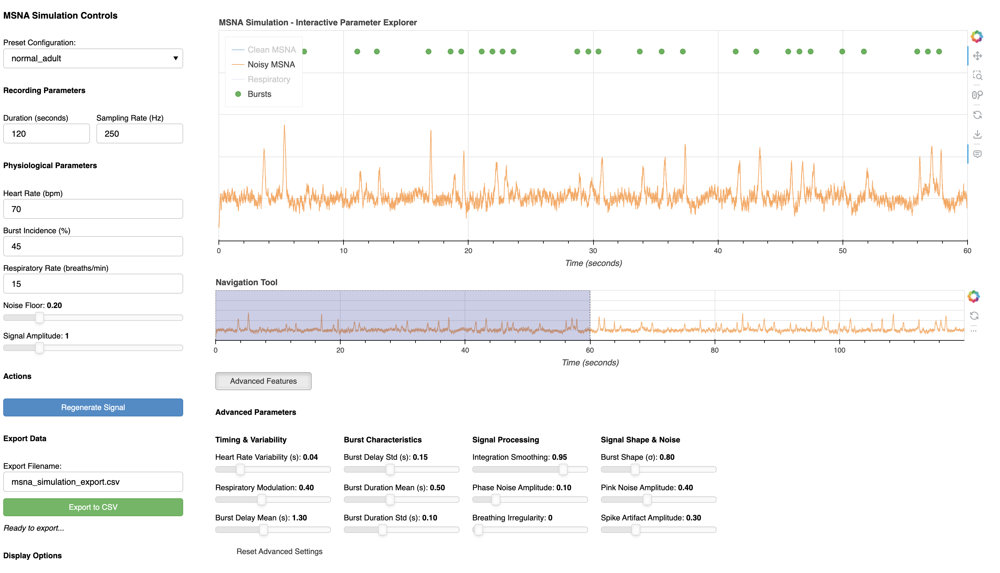

# msna-sim

[](https://badge.fury.io/py/msna-sim)
[](https://opensource.org/licenses/MIT)
[](https://www.python.org/downloads/)

A Python library for generating realistic synthetic Muscle Sympathetic Nerve
Activity (MSNA) signals with physiologically accurate timing, noise
characteristics, and signal properties. This library also includes an
interactive dashboard for real-time parameter exploration and exporting data.

## Overview

Muscle Sympathetic Nerve Activity (MSNA) provides direct measurement of
sympathetic outflow to skeletal muscle vasculature, offering insights into
cardiovascular neural control mechanisms. This library generates realistic
synthetic MSNA signals that closely replicate those obtained through
microneurography recordings. 

The simulator incorporates:
- **Physiologically accurate cardiac synchronization** with heart rate variability
- **Respiratory modulation** of sympathetic activity  
- **Realistic burst morphology** with variable timing and amplitude
- **Comprehensive multi-frequency noise modeling** based on real clinical recordings
- **Interactive dashboard** for parameter exploration and data export

**msna-sim** is designed for algorithm development, method validation,
education, and clinical research applications where realistic synthetic MSNA
data is needed.


## Installation

Install from PyPI:

```bash
pip install msna-sim
```

Requirements will be automatically installed, but can be found in `requirements.txt`.


## Quick Start

### Interactive Dashboard

<p align="center">
 
</p>

Launch the interactive dashboard for real-time parameter exploration:

```bash
msna-sim-dashboard
```

The dashboard allows you to play with various simulation parmaeters, and export
data as CSV. It could be used as the main way to interact with this library for
users with minimal programming experience.

## Examples

### Basic Programmatic Usage

```python
from msna_sim import quick_simulation

# Generate a 60-second recording with default settings
results = quick_simulation(duration = 60, preset = "normal_adult")

# Access the signals
time = results.time
clean_msna = results.clean_msna        # Clean MSNA signal
noisy_msna = results.noisy_msna        # Realistic noisy signal
burst_times = results.burst_peak_idx   # Burst occurrence times

print(f"Generated {results.n_bursts} bursts")
print(f"Burst incidence: {results.burst_incidence:.1f}%")
```


### Using Preset Configurations

```python
from msna_sim import Simulation, create_preset_config

# Available presets include physiological and pathological conditions
presets = [
    "normal_adult", "young_healthy", "athlete", "elderly_healthy",
    "hypertensive", "heart_failure", "bradycardia", "tachycardia", 
    "diabetes", "obesity", "sleep_apnea", "copd", "anxiety",
    "post_exercise", "pristine_lab", "noisy_clinical"
]

# Create simulation with hypertensive patient preset
config = create_preset_config("hypertensive")
simulation = Simulation(config)
results = simulation.simulate(duration = 120, sampling_rate = 1000)

print(f"Heart rate: {results.mean_heart_rate:.1f} bpm")
print(f"Burst incidence: {results.burst_incidence:.1f}%")
```


### Custom Configuration

```python
from msna_sim import Simulation, PatientConfig, SignalConfig

# Create custom patient configuration
patient_config = PatientConfig(
    heart_rate = 75.0,              # beats per minute
    hrv_std = 0.04,                 # heart rate variability
    burst_incidence = 65.0,         # percentage of cardiac cycles with bursts
    noise_floor = 0.25,             # baseline noise level
    signal_amplitude = 1.2,         # relative burst amplitude
    resp_rate = 16.0,               # breaths per minute
    resp_modulation_strength = 0.4  # respiratory modulation strength
)

# Optional: customize signal processing parameters
signal_config = SignalConfig(
    integration_smoothing = 0.95,   # signal integration smoothing
    pink_noise_amplitude = 0.4,     # pink noise contribution
    spike_artifact_amplitude = 0.3  # spike artifact strength
)

simulation = Simulation(patient_config, signal_config)
results = simulation.simulate(duration = 180, sampling_rate = 1000, seed = 42)
```


### Usage Examples

```bash
# Launch dashboard
msna-sim-dashboard
```


## Technical Details

For technical details, refer to the `SPECS.md` file. 


## API Reference

### Core Classes

- **`Simulation`**: Main simulation class
- **`PatientConfig`**: Physiological parameter configuration
- **`SignalConfig`**: Signal processing parameter configuration  
- **`SimulationResults`**: Container for simulation outputs


### Key Functions

- **`quick_simulation()`**: Convenience function for simple simulations
- **`create_preset_config()`**: Load predefined patient configurations


### Simulation Results

The `SimulationResults` object provides:
- **`time`**: Time array in seconds
- **`clean_msna`**: Clean MSNA signal without noise
- **`noisy_msna`**: Realistic MSNA signal with noise
- **`respiratory_signal`**: Respiratory waveform
- **`burst_peak_idx`**: Array of burst occurrence times
- **`n_bursts`**: Total number of bursts
- **`burst_incidence`**: Realized burst incidence percentage


## License

This project is licensed under the MIT License - see the `LICENSE` file for details.


## Citation

If you use this library in your research, please cite:

```bibtex
@software{msna_sim,
  author = {Ryan Peters},
  title = {msna-sim: Realistic MSNA Signal Simulation},
  url = {https://github.com/ryanirl/msna-sim},
  version = {0.1.2},
  year = {2025}
}
```

